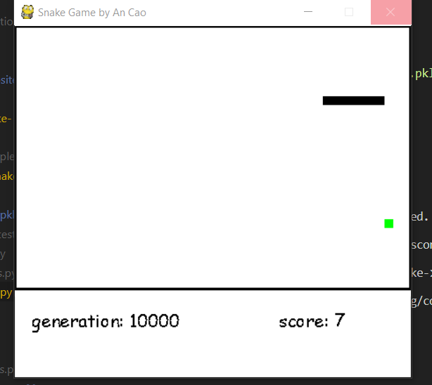

# Q learning snake 

An AI that learns to play snake using Q learning, a type of Reinforcement Learning. The project evaluates the Q values at different states of the snake and utilizes it to predict the correct movement. Q values are calculated based on the rewards when eating food evading walls or itself. 

## Technologies
1. Python 3
2. Reinforcement Learning
3. Object-Oriented Programming
4. Q-Learning
## Install 

This project needs Python 3.6+ and pickle, numpy and pygame installed

```
git clone https://github.com/acao2002/snake-ga.git

```

## Launch 

- The snake is already trained and it is using the saved model SnakeQtable.pkl to run. If you want to train the snake and watch the training process, run this in the QLimprovedSnake folder

```
python SnakeV2QL.py 

```
- The screen will show the snake's performance every 500 episodes and will run for a total of 10000 episodes. Hence, you can see how the snake improves as it gets more exposure to the game.


- If you just want to see the snake after being trained beat the game using the saved model, run this in the same folder

```
python V2SnakePlay.py

```

## Enjoy the AI! 

Now you can execute the program and watch the AI scoops up food!



## License 

MIT


 
